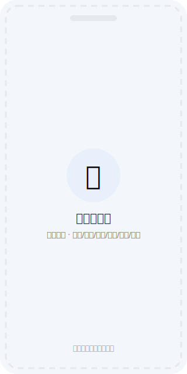
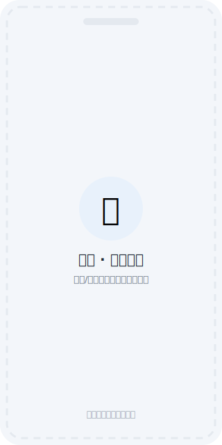
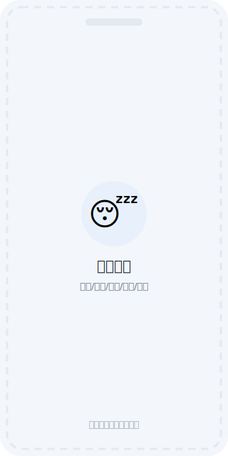
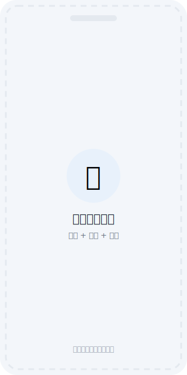
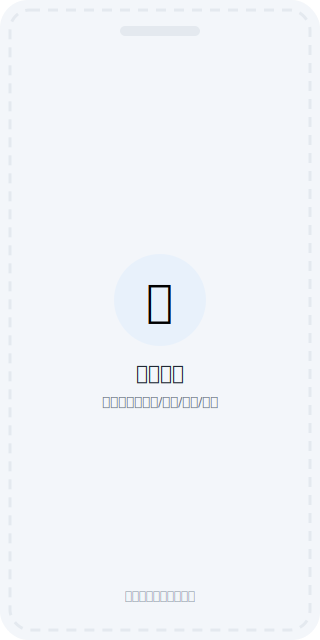
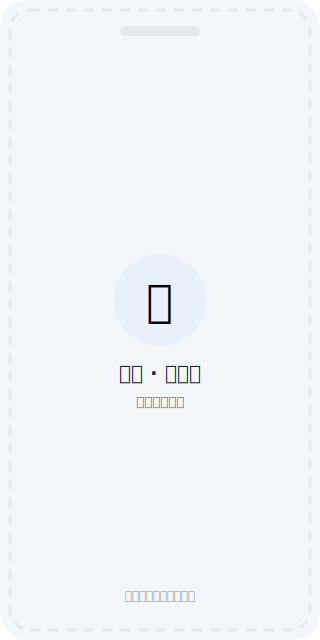
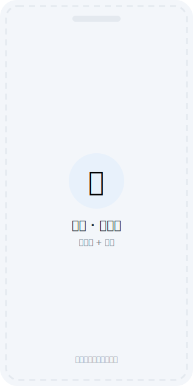
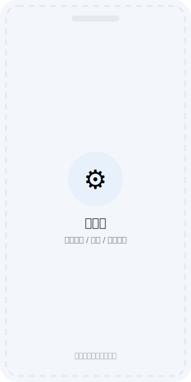

# 健康记录（health-tracker）

本地优先的个人健康记录 Android App。用于低负担记录每日排便、排尿、睡眠、个人状态、焦虑发作与备注，并按日 / 周 / 月回看规律。**所有数据只保存在手机本地**：不联网、无账号、无云同步、无广告和第三方统计 SDK。

- 当前版本：0.1.0（Android APK，架构已为 iOS / 小程序 / 飞书 H5 预留扩展空间）
- 验收报告与手动测试步骤：[docs/acceptance-report.md](docs/acceptance-report.md)
- 小程序端接入预留说明：[docs/miniapp-integration.md](docs/miniapp-integration.md)

> 下方界面截图均为占位图（`docs/screenshots/`），将在真机验收后替换为实际截图。

---

## 产品功能

### 1. 今日页 —— 快速记录

打开 App 默认显示今天。顶部日期栏支持：前一天 / 后一天切换、点击打开月历跳任意日期、一键回到今天；App 过夜后回到前台会自动跟进到新的一天。

<p align="center"></p>

#### 1.1 排便（按次记录）

每次排便记录一条，包含**发生时间、时长、大便状态标签、备注**；当日次数 = 当日记录条数。

两种记录方式（设置中可切换）：

| 模式 | 操作 | 说明 |
| --- | --- | --- |
| **计时模式（默认）** | 排便开始点「▶ 开始计时」，结束点「结束」 | 系统自动记录时长并生成记录，随后可补充状态标签；**超过阈值（默认 8 分钟，可调 5/8/10/15）发本地通知提醒**，前台同时震动、卡片变红；计时状态持久化，杀掉 App 重开可继续；可放弃本次计时 |
| **快速模式** | 点「＋」 | 直接打开编辑页填写详细信息后保存；「−」删除最近一条（有确认） |

两种模式通用能力：

- **补录**：右上角「＋ 补录」可为任意日期补记录。
- **次数手动编辑**：点次数数字直接输入目标值——增加会补空白记录（之后可在列表中补充详情），减少会删除最近的记录（有二次确认）；支持一键清零。
- **大便状态标签**：预设 顺畅 / 偏硬 / 偏稀 / 水样 / 干硬颗粒 / 不成形 / 排不尽感 / 费力 / 颜色异常，点击选中或取消，支持自定义添加。
- 当日记录列表逐条可编辑、可删除（均有确认）。

<table><tr>
<td align="center"><br/><sub>计时模式</sub></td>
<td align="center"><br/><sub>快速模式</sub></td>
</tr></table>

#### 1.2 排尿（计数）

「＋」「−」秒记（最低 0，为 0 时减号禁用），点数字可手动输入次数（0-99 校验）、清零、写备注。

#### 1.3 睡眠

- 时长两种填法：选**开始 + 结束时间**（自动计算时长，支持跨天，如 23:00 - 07:00），或**直接选时长**（4-9 小时快捷选项 + 逐 5 分钟微调）。
- **睡眠质量**：1-5 评分（很差 → 很好）。
- **夜间清醒次数**（步进器）与**夜间清醒总时长**（快捷选项，校验不超过睡眠总时长）。
- **深睡比例**：0-100%（可参考手环等设备数据手动填入）。
- **睡眠标签**：预设 早醒 / 熬夜 / 再次入睡困难 / 多梦 / 夜间惊醒 / 失眠 / 夜尿，支持自定义增删。
- 备注；每天一条，可编辑、可删除（有确认）。

<p align="center"></p>

#### 1.4 个人状态

状态标签多选（精力充沛 / 平静 / 疲惫 / 低落 / 烦躁 / 紧张 / 头痛 / 胃部不适 + 自定义）、1-5 评分、文字备注；三者至少填一项即可保存。每天一条，可编辑、可删除（有确认）。

<p align="center"></p>

#### 1.5 焦虑发作

一天可记多条。每条包含：发生时间、持续时长（快捷选项 5 分钟 - 2 小时）、强度 1-5（轻微 → 强烈）、诱因标签（工作压力 / 人际关系 / 健康担忧 / 经济压力 / 睡眠不足 / 咖啡因 / 不明原因 + 自定义）、备注。列表逐条可编辑、可删除（有确认）。

<p align="center"></p>

#### 1.6 今日备注

当天的自由文本补充，随写随存，清空保存即删除。

### 2. 统计页 —— 日 / 周 / 月回看

三个视图一键切换，「‹ ›」翻区间，点标题可用月历跳转；没有记录的区间显示明确的空状态。

<table><tr>
<td align="center"><br/><sub>日视图</sub></td>
<td align="center"><br/><sub>周视图</sub></td>
<td align="center"><br/><sub>月视图</sub></td>
</tr></table>

- **日视图**：当天全部记录明细（排便逐条、睡眠、状态、焦虑列表、备注）。
- **周视图**（周一至周日）：
  - 排便 / 排尿：每日次数柱状图 + 总次数、日均、记录天数；排便另有**平均时长**和**常见状态 Top3**。
  - 睡眠：每日时长柱状图 + 平均 / 最长 / 最短时长、平均质量、平均清醒次数与时长、平均深睡比例、常见睡眠标签。
  - 焦虑：每日次数分布 + 总次数、总时长、平均强度、常见诱因 Top3。
  - 个人状态：平均评分与记录天数（只记标签未打分的天也计入记录天数）。
- **月视图**（自然月）：同上汇总，另有**记录覆盖日历**——有记录的日期高亮，点任意一天进入当日详情。
- 所有柱状图都支持点击某天跳转当日详情页。

### 3. 设置页

<p align="center"></p>

- **记录偏好**：排便记录方式切换（计时 / 快速），计时超时提醒阈值（5 / 8 / 10 / 15 分钟）。
- **数据导出**（用户主动触发，经系统分享面板保存到任意位置）：
  - JSON：类别定义 + 全部记录 + 每日备注，适合备份与迁移。
  - CSV：记录表 + 每日备注表，带 BOM，Excel / WPS / Numbers 打开中文不乱码；时长、质量、清醒、深睡、强度、标签均为独立列。
- **隐私说明**：数据存哪里、会不会上传、导出如何工作、备份提醒、数据用途。
- 类别管理入口（「即将支持」占位，数据结构已按 schema 预留）、版本信息。

### 4. 数据与隐私承诺

- 所有记录写入本机 SQLite 数据库，重启、杀进程不丢失。
- 默认不联网；无账号、无云同步；不接广告和第三方分析 SDK；飞行模式下全部功能可用（含计时提醒的本地通知）。
- 删除任何记录前都有二次确认；表单输入均有校验；日期一律按本地时区处理。
- 通知权限（Android 13+）仅用于排便计时的本地超时提醒，拒绝授权不影响其他功能。
- 卸载 App 或清除应用数据会删除全部记录，建议定期导出 JSON 备份。

---

## 技术架构

```
health-tracker/
  apps/
    mobile/          # Expo React Native App（Android，未来 iOS 复用同一套代码）
      src/app/       # expo-router 路由（(tabs)/今日|统计|设置、record/*、day/[date]、privacy）
      src/components # UI 组件（排便卡、计数卡、选择器、日历、柱状图等）
      src/db/        # SQLite 适配层（client/migrations/seed/repo，PRAGMA user_version 迁移）
      src/stores/    # zustand 状态（含排便计时器与记录偏好）
      src/features/  # 导出、计时提醒通知等业务功能
  packages/
    core/            # 平台无关：类型、本地时区日期工具、日/周/月统计、JSON/CSV 导出、表单校验（vitest 单测）
    ui-schema/       # 内置类别 seed + 表单字段 schema + 标签/时长预设（未来自定义类别沿用同一结构）
  docs/
```

`packages/core` 与 `packages/ui-schema` 不依赖 React Native，可被未来的 Taro 小程序端 / 飞书 H5 直接复用；各端只需实现自己的存储 adapter 和 UI（见 [docs/miniapp-integration.md](docs/miniapp-integration.md)）。

主要技术栈：Expo SDK 57 / React Native 0.86 / TypeScript（严格模式）/ expo-router / expo-sqlite（同步 API）/ zustand / expo-notifications / expo-file-system + expo-sharing / pnpm workspace。

## 开发

要求：Node ≥ 20、pnpm。

```bash
pnpm install
pnpm --filter mobile start                 # 启动 Expo 开发服务
pnpm --filter @health-tracker/core test    # core 单元测试
pnpm -r typecheck                          # 全仓类型检查
```

## 构建 Android APK（本地）

要求：JDK 17、Android SDK（platform-tools / platforms;android-36 / build-tools;36.0.0 / NDK）。

```bash
cd apps/mobile
npx expo prebuild --platform android --no-install   # 生成/同步 android/ 原生工程
cd android
export JAVA_HOME=/opt/homebrew/opt/openjdk@17
export ANDROID_HOME=$HOME/Library/Android/sdk
./gradlew assembleRelease
# 产物：android/app/build/outputs/apk/release/app-release.apk
```

也可以使用 EAS Build 云构建（需要 Expo 账号）：`npx eas build -p android --profile preview`。

注意：当前 release 构建使用 debug keystore 签名，仅适合个人安装；上架前需要生成正式签名。

## 后续路线

自定义记录类别 → 自定义表单项 → App 锁 / 本地加密 → 趋势洞察（周报/月报）→ 手动备份与可选云同步 → Taro 小程序端 / 飞书 H5。
